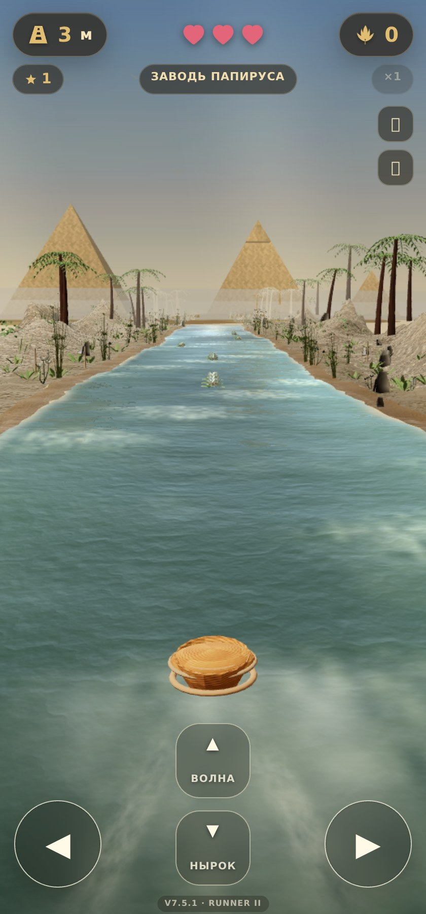

# Более естественный пейзаж «Моисея на Ниле»

После первого обновления повторный рендер отражения и высокая частота
кадров перегружали телефоны. Исправление сохраняет неровные берега и
варианты растений, но уменьшает стоимость кадра и делает пирамиды чётче.

- Пирамиды имеют отдельные нормали граней и более мелкие ряды кладки.
  Общая текстура 512×512 с блоками вразбежку получает UV в мировом масштабе,
  без двойного повторения. Светлый камень сохраняет контраст с небом;
  ночной и пыльный пресеты по-прежнему меняют его оттенок.
- Вода отражает небо, солнце и три дальние пирамиды в текущем кадре.
  Пирамиды пересекаются с отражённым лучом по четырём плоскостям; карта
  повторного рендера сцены больше не создаётся. Отражение не переключается
  скачком при снижении качества. Мелкая рябь меньше искажает силуэты.
- При загруженных нормалях воды процедурная рябь не вычисляется.
  Телефон использует одну карту нормалей, простой шум ила и пены,
  без мелкой каустики и второго слоя нормалей.
- Частота игры ограничена 60 кадрами в секунду, меню и паузы — 15.
  Скрытая вкладка не рисует кадры и не продолжает заплыв.
  Пропуски кадров сохраняют игровое время на экранах 120 и 144 Гц.
- Телефон начинает без отдельного теневого прохода; контактные пятна
  корзинки и препятствий остаются. DPR не превышает 1.25, у слабого класса — 1.
  На компьютере предел DPR — 1.6. Устойчивое падение частоты уменьшает
  разрешение до 80% исходного; оценка FPS использует реальное время кадра.
- Плотность окружения на телефоне ниже, но папирус владельца, игровые
  модели, три силуэта растений и группировка зарослей сохранены.
  Берега, дно, пена и растения совпадают на периодических тайлах 250 метров;
  берег не заходит на три игровые дорожки.

В проверенном портретном кадре основной проход сообщил 285 482
треугольника вместо примерно 564 000 в предыдущем обновлении.
Дополнительных проходов отражения и теней на телефоне теперь нет.
Это сравнение геометрии и проходов, а не замер температуры или FPS телефона.

Проверки: периодичность берегов и глубина, конечные вершины и нормали,
три разных силуэта растений и бюджеты геометрии; WebGL для пяти световых
пресетов, портретный и горизонтальный экран, слабый класс устройства,
снижение разрешения без скачка отражения. При 60/120/144 вызовах в секунду
проверяется реальный цикл игры: около 60 рендеров, секунда игрового времени,
движение корзинки, отсутствие RenderTarget; отдельно — 15 кадров на паузе
и отсутствие кадров и движения в скрытой вкладке.
Проверяются запасной режим, управление, крокодилы, прыжки, безопасные
области интерфейса и свежесть локализованной сборки.

Команды: `npm run check:nile-landscape` и
`CHROME_BIN=/path/to/chrome npm run check:nile-landscape -- --browser`.
Для сохранения кадров задайте `MOSES_SHOTS_DIR`. Доступ к световым пресетам
и синтетические времена кадров добавляются только тестовым сервером.
Рендер проверен через SwiftShader; нагрев на реальных iPhone и Android
нужно проверять на самих устройствах. На скриншоте — локальный 3D-рендер.

